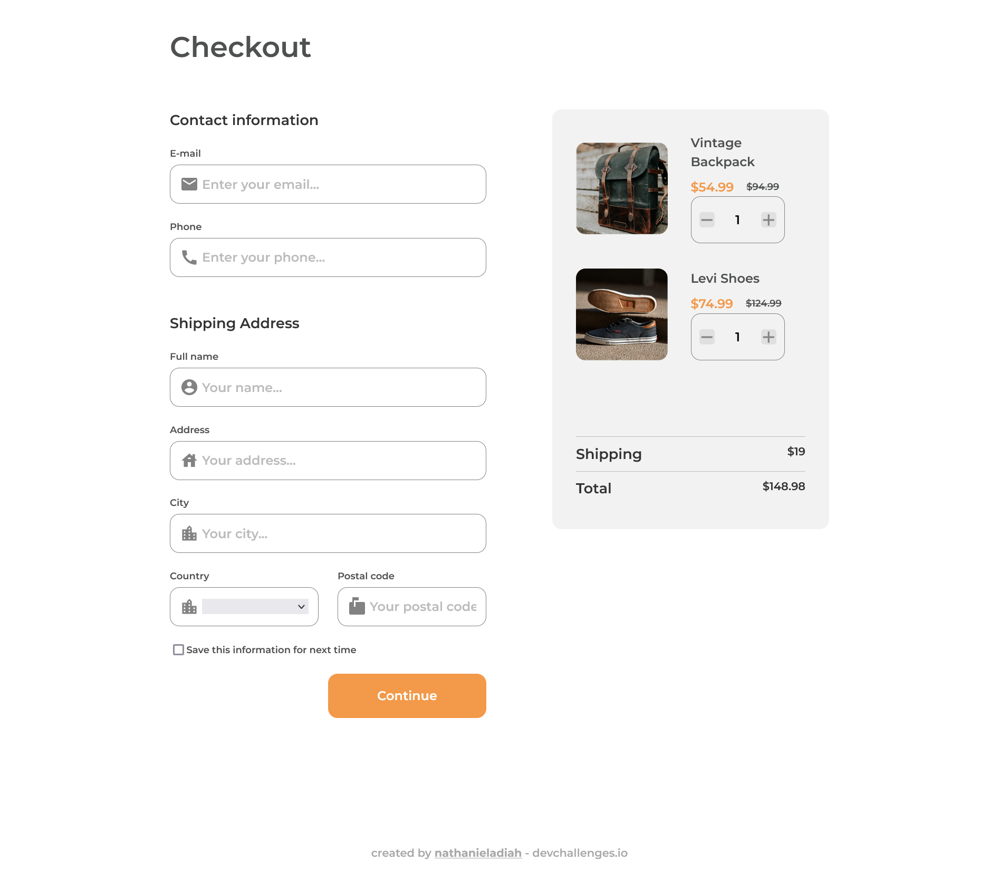

<h1 align="center">Checkout page</h1>

   Solution for a challenge from  <a href="http://devchallenges.io" target="_blank">Devchallenges.io</a>.

  <h3>
    <a href="https://adiah-dev-challenges.github.io/checkout">
      Demo
    </a>
     | 
    <a href="https://github.com/adiah-dev-challenges/checkout">
      Solution
    </a>
     | 
    <a href="https://devchallenges.io/challenges/0J1NxxGhOUYVqihwegfO">
      Challenge
    </a>
  </h3>

<!-- TABLE OF CONTENTS -->

## Table of Contents

- [Overview](#overview)
  - [Built With](#built-with)
- [Features](#features)
- [Contact](#contact)
- [Acknowledgements](#acknowledgements)

<!-- OVERVIEW -->

## Overview

### Built With

* Sass
* Flexbox

## Features

This application/site was created as a submission to a [DevChallenges](https://devchallenges.io/challenges) challenge. The [challenge](https://devchallenges.io/challenges/0J1NxxGhOUYVqihwegfO) was to build an application to complete the given user stories.

- [x] Page follows the given design
- [ ] User can input email, phone, full name, address, city, country and postal code
- [ ] User can input the number of items
- [ ] User can select at least 3 countries from the dropdown
- [ ] Warning displays if form submitted with failing validation
- [ ] Success alert displays if validation successful

## How To Use

## Acknowledgements

## Contact

- Website [nathanieladiah.github.io](https://nathanieladiah.github.io)
- GitHub [@nathanieladiah](https://github.com/nathanieladiah)